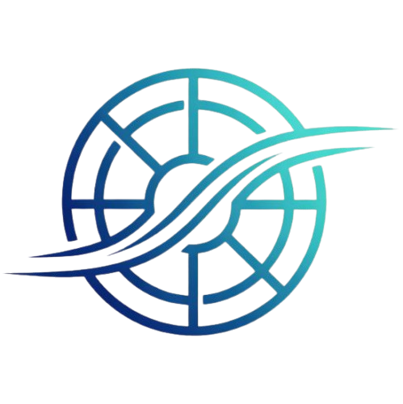
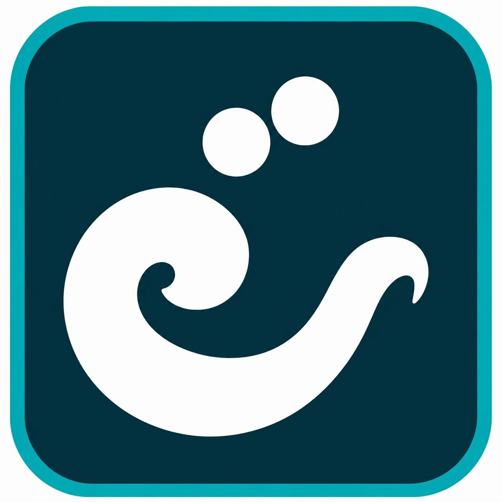
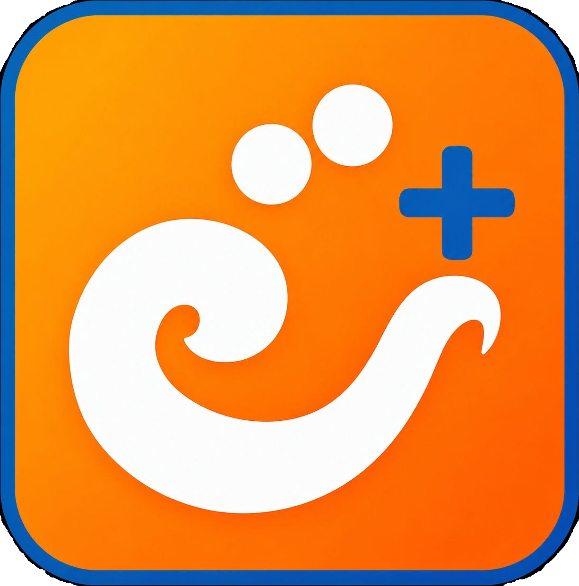
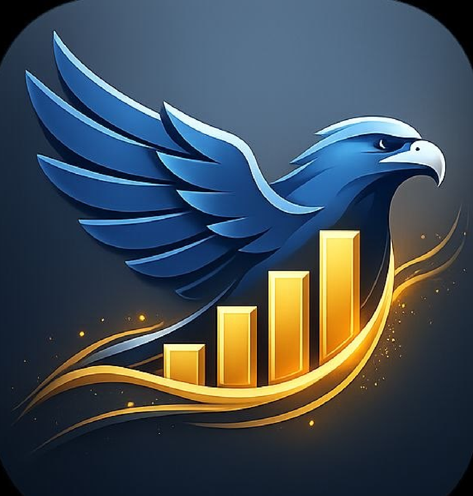
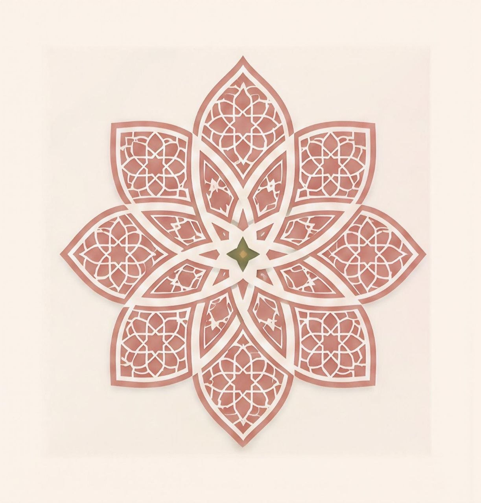
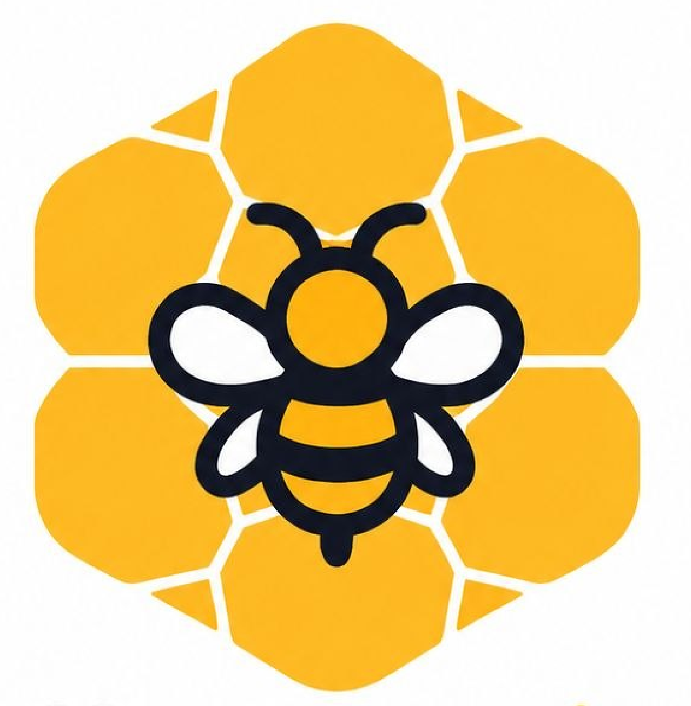
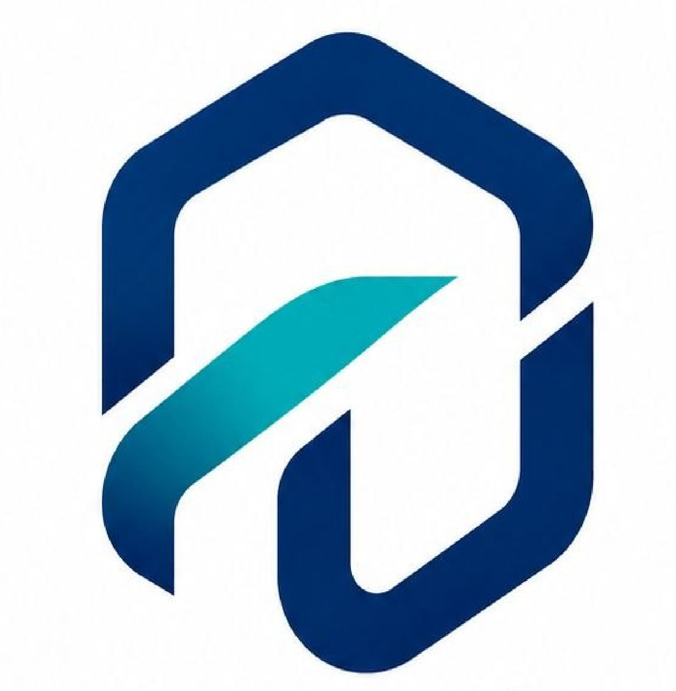

<!DOCTYPE html>
<html lang="ar" dir="rtl">
<head>
    <meta charset="UTF-8">
    <meta name="viewport" content="width=device-width, initial-scale=1.0">
    <title>أورانتوس | شركة تقنية قابضة سورية</title>
    <meta name="description" content="أورانتوس هي منظومة تقنية سورية مكرسة لبناء وامتلاك منصات رقمية مبتكرة، وبنية تحتية مالية، وشبكات ذكاء اصطناعي متطورة.">
    
    <!-- خطوط بريميوم تدعم العربية -->
    <link rel="preconnect" href="https://fonts.googleapis.com">
    <link rel="preconnect" href="https://fonts.gstatic.com" crossorigin>
    <link href="https://fonts.googleapis.com/css2?family=Plus+Jakarta+Sans:wght@300;400;500;600;700;800&family=Tajawal:wght@300;400;500;700;900&display=swap" rel="stylesheet">
    <!-- أيقونة التبويب للموقع (Favicon) -->
<link rel="icon" type="image/png" href="logos/orantos-main.png">
    <!-- نظام أيقونات لوكيد -->
    

    
</head>
<body data-theme="dark">

    <!-- نظام الملاحة الرأسي -->
    <nav class="navbar">
        <a href="#" class="logo" style="display: flex; align-items: center; gap: 15px;">
            

                
            

            ORANTOS
        </a>
        <ul class="nav-links">
            <li><a href="#about">المنظومة</a></li>
            <li><a href="#portfolio">شركاتنا</a></li>
            <li><a href="#governance">الحوكمة</a></li>
            <li><a href="#careers">الوظائف</a></li>
        </ul>
        

            <button class="theme-toggle" id="themeToggle" aria-label="تبديل الوضع اللوني">
                <i data-lucide="sun" id="themeIcon"></i>
            </button>
            <a href="#contact" class="btn btn-secondary" style="padding: 10px 20px; font-size: 0.85rem; border-radius: 4px;">استفسار مؤسسي</a>
        

    </nav>

    <!-- قسم الواجهة الرئيسية (Hero Section) -->
    <section class="hero">
        

            

                شركة تقنية قابضة سورية
                <h1>هندسة البنية التحتية الرقمية التي تمكّن المجتمعات</h1>
                
تقوم أورانتوس ببناء وتوسيع وإدارة عائلة متكاملة من المنصات الرقمية المستقلة في مجالات التجارة المتقدمة، اللوجستيات الذكية، الأدوات المالية السيادية، والحوسبة المعرفية.

                

                    <a href="#portfolio" class="btn btn-primary">استكشاف الشركات</a>
                    <a href="#about" class="btn btn-secondary">الملف المؤسسي</a>
                

            

            

                

                    

                        

                    

                

            

        

    </section>

    <!-- النبذة التنفيذية -->
    <section id="about" class="reveal">
        إيجاز تنفيذي
        

            <h2>هيكلية القدرات المشتركة</h2>
        

        

            

                "بدلاً من عزل التطورات التقنية، تعمل أورانتوس كقاعدة مرجعية عابرة للصناعات. نحن نهندس أنظمة موحدة تحول العمليات اليومية إلى شبكة رقمية سورية أكثر مرونة وأماناً."
            

            

                

                    <h3>07</h3>
                    
صناعات جوهرية نقود فيها التحول الرقمي الكامل

                

                

                    <h3>متكاملة</h3>
                    
أنظمة مالية وحوسبة سحابية قابلة للتوافق البيني

                

            

        

    </section>

    <!-- محفظة الشركات والمنصات القابضة -->
    <section id="portfolio" class="reveal">
        شركات المنظومة
        

            <h2>منصاتنا العاملة عالمياً</h2>
            
شركات مستقلة إستراتيجياً، متصلة تقنياً وقائمة على الابتكار المشترك تحت قيادة تقنية موحدة.

        

        

            
            

                

                    

                        
                    

                    

                        <h3>Trendat (تريندات)</h3>
                        
منصة تجارة إلكترونية ذكية تربط العملاء بالشركات وتحسن كفاءة المعاملات عبر سوق رقمي متطور.

                    

                

                <a href="#" class="product-link">استعراض البنية التحتية <i data-lucide="arrow-left"></i></a>
            

            

                

                    

                        
                    

                    

                        <h3>T+</h3>
                        
منصة خدمات لوجستية وتوصيل ذكي فوري عند الطلب، تعتمد على التوجيه الذكي للمسارات التجارية المختلفة.

                    

                

                <a href="#" class="product-link">استعراض البنية التحتية <i data-lucide="arrow-left"></i></a>
            

            

                

                    

                        
                    

                    

                        <h3>العقاب (Al-Oqab)</h3>
                        
بنية تحتية مالية رقمية آمنة لمعالجة المدفوعات، التحويلات، المحافظ الرقمية والتقنيات النقدية المستقبلية.

                    

                

                <a href="#" class="product-link">استعراض البنية التحتية <i data-lucide="arrow-left"></i></a>
            

            

                

                    

                        
                    

                    

                        <h3>وردي (Wardi)</h3>
                        
تطبيق إنتاجية يومي معرفي مصمم لإدارة المهام والتخطيط، التقييم الشخصي وتتبع العادات الفردية والمؤسسية.

                    

                

                <a href="#" class="product-link">استعراض البنية التحتية <i data-lucide="arrow-left"></i></a>
            

            

                

                    

                        
                    

                    

                        <h3>السبيل (Al-Sabeel)</h3>
                        
منصة سفر متكاملة لحجز الرحلات، الفنادق، وتنظيم التجارب السياحية بالاعتماد على تحليلات البيانات الضخمة.

                    

                

                <a href="#" class="product-link">استعراض البنية التحتية <i data-lucide="arrow-left"></i></a>
            

            

                

                    

                        
                    

                    

                        <h3>خلية (Khaliyah)</h3>
                        
منصة تواصل اجتماعي من الجيل الجديد تركز على المجتمعات الحقيقية، الإبداع والخصوصية المطلقة المشفرة.

                    

                

                <a href="#" class="product-link">استعراض البنية التحتية <i data-lucide="arrow-left"></i></a>
            

        

    </section>
    <!-- محرك الحوسبة والذكاء الاصطناعي المركزي -->
    <section class="intel-section reveal">
        

            

                

                    
                

                
                نواة الحوسبة المتقدمة
                <h2>حكيم للذكاء الاصطناعي (Hakim AI)</h2>
                
المحرك الإدراكي التشغيلي الذي يدعم كافة التفاعلات والمنصات لشبكة أورانتوس.

                
يوفر Hakim AI معالجة ذكية للبيانات، بروتوكولات الأتمتة الصناعية، أنظمة إدارة المعرفة، والنماذج الخوارزمية الفائقة المستخدمة بالكامل في خطوط الإنتاج والحلول البرمجية التابعة لشركاتنا.

                <a href="#" class="btn btn-primary">مراجعة وثائق الأبحاث</a>
            

            

                
                

                    

                        
                        

                    

                        <h4>أنظمة الإستراتيجية الآلية</h4>
                        
تقديم نماذج اتخاذ القرار الفوري عالي التزامن مباشرة إلى التطبيقات والشبكات.

                    

                

                
                

                    

                        
                        

                    

                        <h4>نماذج البيانات السيادية</h4>
                        
طبقات بيانات معزولة تماماً تضمن بقاء الأصول المعرفية والفكرية للمؤسسات محمية بشكل كامل.

                    

                

                
            

        

    </section>

    <!-- قيم الحوكمة والمبادئ المؤسسية -->
    <section id="governance" class="reveal">
        إطار العمل التشغيلي
        

            <h2>ركائزنا الجوهرية الثابتة</h2>
        

        

            

                <h3>الابتكار</h3>
                
نشر آليات حوسبة متطورة تسبق الحلول التقليدية الموروثة للمؤسسات.

            

            

                <h3>الثقة</h3>
                
تنفيذ استمرارية هيكلية يعتمد عليها ملايين الأفراد والشركات يومياً لدعم المنصات الحيوية.

            

            

                <h3>الخصوصية</h3>
                
تطبيق نماذج عزل بيانات صارمة لضمان حماية أمن المستخدم وتأمين اتصالاته.

            

            

                <h3>البساطة</h3>
                
تفكيك الطبقات اللوجستية المعقدة إلى واجهات واضحة ومباشرة مبنية للاستخدام السلس.

            

            

                <h3>الأمان</h3>
                
دمج عمليات التحقق والتشفير من نوع (Zero-Trust) في أعمق طبقات أطر عمل منتجاتنا.

            

            

                <h3>التصميم المتمحور حول الإنسان</h3>
                
هندسة أطر عمل رقمية مصممة خصيصاً لتعزيز الكفاءة الواقعية وتحفيز الفاعلية الإنسانية.

            

            

                <h3>التميز</h3>
                
فرض ممارسات اختبار صارمة لضمان أعلى جودة في أنظمة قواعد البيانات الضخمة.

            

            

                <h3>التفكير بعيد المدى</h3>
                
توجيه الاستثمارات الرأسمالية نحو المشاريع المصممة لخدمة الأجيال الرقمية القادمة لعقود.

            

        

    </section>

    <!-- قطاع التوظيف ورأس المال البشري -->
    <section id="careers" class="reveal">
        

            

                <h2>شكل ملامح الأفق الرقمي القادم</h2>
                
تستقبل أورانتوس باستمرار طلبات الانضمام من كبار المهندسين والمطورين، خبراء التشفير والأنظمة الأمنية، وقادة المنتجات المتميزين من حول العالم.

            

            

                <a href="#" class="btn">عرض الفرص المتاحة <i data-lucide="arrow-up-left"></i></a>
            

        

    </section>

    <!-- التواصل المؤسسي والإستراتيجي -->
    <section id="contact" class="reveal" style="padding-top: 40px; text-align: center;">
        

            العلاقات المؤسسية
            <h2 style="font-size: 2.5rem; margin-bottom: 20px;">المقر سورية / حماة</h2>
            
للاستفسارات الإستراتيجية، العلاقات الحكومية، أو تحالفات منصات العمليات الكبرى، يرجى التنسيق عبر مكتب العلاقات والتبادل المؤسسي.

            <a href="mailto:relations@orantos.com" class="btn btn-secondary">contact@orantos.com</a>
        

    </section>

    <!-- تذييل المجموعة القابضة -->
    <footer>
        

            

                <a href="#" class="logo" style="display: flex; align-items: center; gap: 12px; text-decoration: none;">
                    

                        
                    

                    ORANTOS
                </a>
                
كيان مؤسسي سورية / حماة يدير منصات بخرائط برمجية وبنية تحتية سيادية مصممة لتحقيق الاستدامة التكنولوجية الطويلة.

            

            

                <h4>هيكل المجموعة</h4>
                <ul>
                    <li><a href="#about">نظرة عامة على المنظومة</a></li>
                    <li><a href="#portfolio">المحافظ التشغيلية</a></li>
                    <li><a href="#governance">الحوكمة المؤسسية</a></li>
                </ul>
            

            

                <h4>المنصات التابعة</h4>
                <ul>
                    <li><a href="#">تريندات للتجارة الرقمية</a></li>
                    <li><a href="#">لوجستيات شبكة T+</a></li>
                    <li><a href="#">البنية التحتية الماليّة لـ العقاب</a></li>
                    <li><a href="#">أبحاث حكيم للذكاء الاصطناعي</a></li>
                </ul>
            

            

                <h4>الامتثال والخصوصية</h4>
                <ul>
                    <li><a href="#">علاقات المستثمرين</a></li>
                    <li><a href="#">نشرات وتقارير الأمن السيبراني</a></li>
                    <li><a href="#">سياسات التشفير المعتمدة</a></li>
                </ul>
            

        

        

            
&copy; 2026 أورانتوس. جميع الحقوق المؤسسية محفوظة.

            

                <a href="#"> الإفصاح التنظيمي</a>
                <a href="#">إطار حماية الخصوصية</a>
            

        

    </footer>

    <!-- محرك التفاعلات للواجهة -->
    
</body>
</html>
